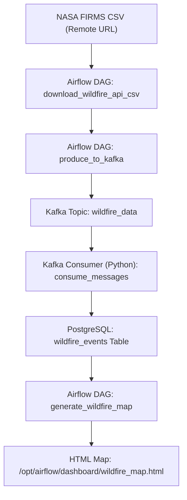

# Wildfire Monitoring & Analysis Pipeline 🌍🔥

This project sets up a data pipeline for near real-time wildfire monitoring using:
- NASA FIRMS API (VIIRS)
- Apache Airflow
- Apache Kafka
- PostgreSQL
- Python (Kafka consumer + Folium mapping)

---

## 🔧 Architecture Overview



---

## 📂 Project Structure

```
wildfire-monitoring-analysis/
│
├── airflow/                  # Airflow DAGs & ETL logic
│   ├── dags/
│   │   └── wildfire_etl_dag.py
│   └── etl/
│       ├── download.py
│       ├── kafka_producer.py
│       ├── generate_map.py
│       └── config.py
│
├── kafka_consumer/           # Kafka consumer to PostgreSQL
│   ├── consumer.py
│   ├── create_topic.py (optional)
│   └── Dockerfile
│
├── postgres/
│   └── init/
│       └── init.sql          # Creates `wildfire_db` and `wildfire_events` table
│
├── dashboard/                # Generated HTML wildfire map
├── data/                     # Local storage for raw CSV from FIRMS
│
├── docker-compose.yml
├── .env
├── .gitignore
├── README.md
└── wildfire-architecture.md
```

---

## 🚀 Running the Pipeline

Make sure Docker and Docker Compose are installed. Then run:

```bash
docker-compose up --build
```

Access the Airflow UI at:  
**http://localhost:8080**  
Default login credentials:  
`admin` / `admin`

---

## 🗺 Output

- Wildfire data from the past 3 days is fetched via NASA FIRMS API.
- Records are streamed into Kafka and inserted into PostgreSQL.
- An interactive HTML map is generated at `/opt/airflow/dashboard/wildfire_map.html`.

---

## 🗺 Example Wildfire Map

Below is a screenshot of the wildfire map generated by the pipeline, showing wildfire activity data for **July 27-29, 2025**.  
*Note: The map updates regularly, so data will vary over time.*


---

## 🔒 Deduplication Logic

Handled in the Kafka consumer using a unique constraint:

```sql
UNIQUE (latitude, longitude, acq_date, acq_time, satellite)
```

If a duplicate is encountered, the insertion is skipped to avoid redundancy.

---

## 📦 Tech Stack

- **Python 3.11**
- **Apache Airflow 2.8.1**
- **PostgreSQL 14**
- **Apache Kafka (Bitnami)**
- **Docker Compose**
- **Folium** for map generation
