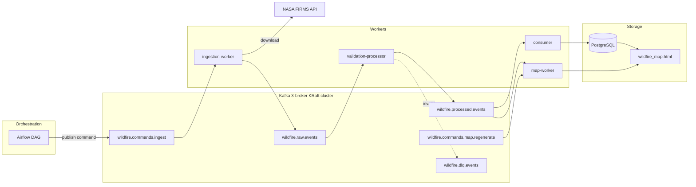

# Wildfire Monitoring and Analysis Platform

An event-driven wildfire detection and visualization platform that ingests near-real-time satellite hotspot data from NASA FIRMS (VIIRS), streams it through Apache Kafka, validates and stores detections in PostgreSQL, and produces interactive Folium maps for exploration and reporting.

The system is designed for **asynchronous, decoupled processing**: Apache Airflow publishes **commands** to Kafka on a schedule; microservices react to events without blocking the orchestrator. Each HTTP-facing component is a **FastAPI** service with health checks and Prometheus-compatible metrics.

---

## Table of Contents

- [Business Purpose](#business-purpose)
- [Architecture](#architecture)
- [Data Flow](#data-flow)
- [Quick Start](#quick-start)
- [Public Interactive Demo](#public-interactive-demo)
- [Services and Ports](#services-and-ports)
- [Kafka Topics and Consumer Groups](#kafka-topics-and-consumer-groups)
- [API Reference](#api-reference)
- [Airflow Orchestration](#airflow-orchestration)
- [PostgreSQL](#postgresql)
- [Configuration](#configuration)
- [Production Readiness](#production-readiness)
- [High Availability Options](#high-availability-options)
- [Repository Structure](#repository-structure)
- [Development](#development)
- [Troubleshooting](#troubleshooting)
- [Technology Stack](#technology-stack)

---

## Business Purpose

Wildfires threaten lives, infrastructure, and ecosystems. Agencies and analysts need **timely, geospatial awareness** of active fire detections to prioritize response, communicate risk, and study patterns over time.

This platform:

1. **Ingests** VIIRS near-real-time fire detections for a configurable geographic bounding box (default: California) from NASA FIRMS.
2. **Validates** records against schema and domain rules before persistence.
3. **Stores** deduplicated events in PostgreSQL for querying and analytics.
4. **Visualizes** detections on an interactive HTML map (brightness-based markers, layer switching, pop-up detail).

It demonstrates production-oriented patterns—Kafka as an event bus, idempotent writes, dead-letter queues, horizontal worker scaling, scheduled backups, and optional HA overlays—suitable for portfolio review by software, data, or platform engineering audiences.

---

## Architecture


```mermaid
flowchart LR
  subgraph orchestration [Orchestration]
    AF[Airflow DAG]
  end

  subgraph kafka [Kafka 3-broker KRaft cluster]
    CI[wildfire.commands.ingest]
    CR[wildfire.raw.events]
    CP[wildfire.processed.events]
    CM[wildfire.commands.map.regenerate]
    DLQ[wildfire.dlq.events]
  end

  subgraph workers [Workers]
    IW[ingestion-worker]
    VP[validation-processor]
    CW[consumer]
    MW[map-worker]
  end

  subgraph storage [Storage]
    PG[(PostgreSQL)]
    MAP[wildfire_map.html]
  end

  NASA[NASA FIRMS API]

  AF -->|publish command| CI
  CI --> IW
  IW -->|download| NASA
  IW --> CR
  CR --> VP
  VP --> CP
  VP -.->|invalid| DLQ
  CP --> CW
  CW --> PG
  CP --> MW
  CM --> MW
  MW --> MAP
  PG --> MAP
```

**Compose layout (logical roles):**

| Role | Services |
|------|----------|
| Orchestration | `airflow-webserver`, `airflow-scheduler`, `airflow-scheduler-2`, `airflow-triggerer` |
| Event bus | `kafka-1`, `kafka-2`, `kafka-3`, `kafka-topics-init`, `kafka-ui` |
| Ingestion | `ingestion-api` (HTTP), `ingestion-worker` (Kafka commands → raw events) |
| Validation | `validation-processor` (raw → processed) |
| Persistence | `consumer` / `consumer-api`, `postgres`, `postgres-backup` |
| Visualization | `map-api` (HTTP + tiles), `map-worker` (Kafka → HTML map) |
| Legacy / optional | `producer` (HTTP → ingest command), `kafka_consumer` (legacy `wildfire_data` topic) |

**API vs worker split:** In default Compose, `ingestion-api` and `map-api` disable background Kafka consumers (`INGESTION_COMMAND_CONSUMER_ENABLED=false`, `MAP_CONSUMER_ENABLED=false`). Scalable processing runs in `ingestion-worker` and `map-worker`.

---

## Data Flow

### Primary path (event-driven)

1. **Trigger** — Airflow DAG `wildfire_etl_pipeline` (daily UTC) or `POST /produce` publishes an ingestion command to `wildfire.commands.ingest` (`acks=all`, gzip).
2. **Ingest** — `ingestion-worker` consumes the command, downloads CSV from NASA FIRMS, emits one message per detection to `wildfire.raw.events`. Failures can be sent to `wildfire.dlq.events`.
3. **Validate** — `validation-processor` consumes raw events, applies rules in `airflow/etl/validation.py`, produces valid records to `wildfire.processed.events`, routes invalid/unparseable payloads to the DLQ.
4. **Persist** — `consumer` (group `wildfire_group`) batch-inserts into `wildfire_events` with `ON CONFLICT DO NOTHING`.
5. **Visualize** — `map-worker` (group `wildfire_map_generator`) regenerates `airflow/dashboard/wildfire_map.html` on processed events and optional map commands, using a Postgres advisory lock when multiple replicas run.

Airflow does **not** call ingestion or map over HTTP and does **not** wait for pipeline completion.

### Secondary paths

| Path | Behavior |
|------|----------|
| **HTTP ingestion** | `POST /ingest` on `ingestion-api` downloads FIRMS data synchronously and produces to `KAFKA_TOPIC` (Compose default: legacy `wildfire_data`). Does not use the raw → validation → processed pipeline unless you reconfigure topics. |
| **Legacy consumer** | `kafka_consumer` service consumes `wildfire_data` and writes to PostgreSQL. Enabled in Compose for backward compatibility; not on the primary event-driven path. |
| **Explicit map command** | DAG param `send_explicit_map_regeneration=true` publishes to `wildfire.commands.map.regenerate`. Otherwise maps update from processed events only. |

---

## Quick Start

### Requirements

- Docker 20.10+ and Docker Compose v2
- Free host ports: **8080** (Airflow), **8081** (Kafka UI), **5432** (or `POSTGRES_HOST_PORT`), **9092** / **9094** / **9095** (Kafka), **8000–8003** (APIs)

### Installation

```bash
git clone <repo-url>
cd wildfire-monitoring-analysis
cp .env.example .env
# Edit .env: FIRMS_MAP_KEY, POSTGRES_PASSWORD, WILDFIRE_API_KEY, AIRFLOW_ADMIN_PASSWORD (required)
docker compose up -d --build
```

### Public Interactive Demo

A **Kafka-free** stack for sharing a browser-based demo (dashboard, map, Swagger) without running the full pipeline.

```bash
cp env.demo.example .env
docker compose -f docker-compose.demo.yml up -d --build
./scripts/seed_demo_data.sh
```

| URL | Description |
|-----|-------------|
| http://localhost:8003/ | Dashboard (map + table + filters) |
| http://localhost:8003/demo/wildfires | JSON API |
| http://localhost:8003/map | Folium map |
| http://localhost:8003/docs | Swagger UI |

AWS step-by-step deployment: **[docs/PUBLIC_DEMO_DEPLOYMENT.md](docs/PUBLIC_DEMO_DEPLOYMENT.md)**.

Production ingest remains **Kafka → ETL → PostgreSQL**; the public path is **PostgreSQL → FastAPI → dashboard**.

### One-time Airflow initialization

If the Airflow UI login fails on first boot:

```bash
docker compose run --rm airflow-init
docker compose restart airflow-webserver
```

### Access

| Resource | URL |
|----------|-----|
| Airflow UI | http://localhost:8080 (credentials from `AIRFLOW_ADMIN_*` in `.env`) |
| Kafka UI | http://localhost:8081 |
| Ingestion API | http://localhost:8000/docs |
| Producer API | http://localhost:8001/docs |
| Consumer API | http://localhost:${CONSUMER_API_PORT:-8002}/docs |
| Map API | http://localhost:8003/docs |
| Generated map (file) | `airflow/dashboard/wildfire_map.html` |
| Generated map (HTTP) | http://localhost:8003/map |

### Trigger a pipeline run

```bash
docker compose exec airflow-webserver airflow dags trigger wildfire_etl_pipeline
```

Or use the Airflow UI. Processing is asynchronous; allow time for ingestion → validation → DB → map.

### Scale workers

```bash
docker compose up -d --build \
  --scale consumer=3 \
  --scale ingestion-worker=2 \
  --scale map-worker=2
```

`consumer` has no published host port (avoids collisions). Use `consumer-api` for HTTP health/stats on port 8002.

---

## Services and Ports

| Service | Host port | Purpose |
|---------|-----------|---------|
| `ingestion-api` | 8000 | FIRMS download via `POST /ingest` (legacy topic); health/metrics |
| `producer` | 8001 | `POST /produce` → Kafka ingest command |
| `consumer-api` | `${CONSUMER_API_PORT:-8002}` | Health, metrics, `/stats`; also runs DB consumer thread |
| `map-api` | 8003 | Map generation, `/map`, OSM tile proxy |
| `airflow-webserver` | 8080 | DAG UI |
| `kafka-ui` | 8081 | Cluster inspection |
| `postgres` | `${POSTGRES_HOST_PORT:-5432}` | `wildfire_db` + `airflowdb` |
| `kafka-1` | 9092 | Broker (internal: `kafka-1:9092`) |
| `kafka-2` | 9094 | Broker |
| `kafka-3` | 9095 | Broker |

**Automated on `docker compose up`:**

- `kafka-topics-init` — runs `python -m etl.kafka_topics` once after brokers are healthy
- `validation-processor` — continuous raw → processed validation
- `postgres-backup` — daily logical backups to `./backups/postgres`

---

## Kafka Topics and Consumer Groups

Topics are defined in `airflow/etl/kafka_topics.py` and created by `kafka-topics-init`.

| Topic | Purpose | Default partitions (Compose) | Retention |
|-------|---------|-------------------------------|-----------|
| `wildfire.commands.ingest` | Trigger FIRMS ingestion | 3 | 1 day |
| `wildfire.raw.events` | Raw detections from ingestion | 6 | 7 days |
| `wildfire.processed.events` | Validated detections | 6 | 7 days |
| `wildfire.commands.map.regenerate` | Explicit map rebuild | 3 | 1 day |
| `wildfire.dlq.events` | Failed validation, parse errors, bad commands | 3–6 | 14 days |
| `wildfire_data` | **Legacy** (deprecated) | 3 | 7 days |

Replication factor **3** and `min.insync.replicas=2` are set on brokers in `docker-compose.yml`. Override via `KAFKA_TOPIC_REPLICATION_FACTOR`, `KAFKA_EVENT_TOPIC_PARTITIONS`, `KAFKA_COMMAND_TOPIC_PARTITIONS`.

| Consumer group | Service | Subscribes to |
|----------------|---------|---------------|
| `wildfire_ingestion` | `ingestion-worker` | `wildfire.commands.ingest` |
| `wildfire_validation` | `validation-processor` | `wildfire.raw.events` |
| `wildfire_group` | `consumer`, `consumer-api`, `kafka_consumer` | `wildfire.processed.events` or legacy `wildfire_data` |
| `wildfire_map_generator` | `map-worker` | `wildfire.processed.events`, `wildfire.commands.map.regenerate` |

**Inspect topics (use broker service name `kafka-1`, not `kafka`):**

```bash
docker compose exec kafka-1 kafka-topics --list --bootstrap-server kafka-1:9092

docker compose exec kafka-1 kafka-console-consumer \
  --bootstrap-server kafka-1:9092 \
  --topic wildfire.commands.ingest \
  --from-beginning
```

---

## API Reference

Protected routes require `X-API-Key: <WILDFIRE_API_KEY>` or `Authorization: Bearer <key>` when `AUTH_ENABLED=true` (default on APIs in Compose).

### Ingestion (`ingestion-api`, port 8000)

| Method | Path | Auth | Description |
|--------|------|------|-------------|
| GET | `/health` | No | Liveness |
| GET | `/metrics` | No | Prometheus metrics |
| POST | `/ingest` | Yes | Synchronous FIRMS download; produces valid rows to `KAFKA_TOPIC` (default `wildfire_data`) |

### Producer (`producer`, port 8001)

| Method | Path | Auth | Description |
|--------|------|------|-------------|
| GET | `/health` | No | Liveness |
| GET | `/metrics` | No | Prometheus metrics |
| POST | `/produce` | Yes | Publish ingestion command to `wildfire.commands.ingest` (async pipeline) |

Query params: `area`, `day_range`, `source` (optional; defaults from config).

### Consumer (`consumer-api`, port 8002)

| Method | Path | Auth | Description |
|--------|------|------|-------------|
| GET | `/health` | No | Consumer thread status and uptime |
| GET | `/metrics` | No | Prometheus metrics |
| GET | `/stats` | Yes | Processing counters |
| POST | `/start` | Yes | Start background consumer |
| POST | `/stop` | Yes | Request consumer stop |

Worker replicas (`consumer`) run the same Kafka→Postgres logic without exposing HTTP.

### Map (`map-api`, port 8003)

| Method | Path | Auth | Description |
|--------|------|------|-------------|
| GET | `/health` | No | Liveness |
| GET | `/metrics` | No | Prometheus metrics |
| GET | `/map` | No | Generate or return HTML map (`format=html` or `json`) |
| POST | `/generate` | Yes | Write map file; returns JSON metadata |
| GET | `/osm-tiles/{z}/{x}/{y}.png` | No | OSM tile proxy (policy-compliant Referer/User-Agent) |

Query params for map routes: `center_lat`, `center_lon`, `zoom`, `lookback_days`, `max_records`.

**Example requests:**

```bash
export WILDFIRE_API_KEY="your-key-from-env"

# Event-driven ingest (recommended)
curl -H "X-API-Key: $WILDFIRE_API_KEY" -X POST "http://localhost:8001/produce"

# Synchronous FIRMS fetch + legacy Kafka topic
curl -H "X-API-Key: $WILDFIRE_API_KEY" -X POST \
  "http://localhost:8000/ingest?area=-125.0,32.0,-113.0,42.0&day_range=3"

# Regenerate map file
curl -H "X-API-Key: $WILDFIRE_API_KEY" -X POST \
  "http://localhost:8003/generate?center_lat=37.0&center_lon=-120.0&zoom=5"

# Consumer status
curl -H "X-API-Key: $WILDFIRE_API_KEY" http://localhost:8002/stats
```

---

## Airflow Orchestration

| Item | Value |
|------|-------|
| DAG ID | `wildfire_etl_pipeline` |
| Schedule | `@daily` (midnight UTC) |
| Executor | `LocalExecutor` |
| Metadata DB | PostgreSQL database `airflowdb` |

**Tasks:**

1. `send_ingestion_command` — publish to `wildfire.commands.ingest` (retries: 3)
2. `send_map_regeneration_command` — publishes to `wildfire.commands.map.regenerate` only if DAG param `send_explicit_map_regeneration` is `true` (default: `false`)

**DAG params** (editable in UI): `firms_area`, `day_range`, `map_center_lat`, `map_center_lon`, `map_zoom`, `send_explicit_map_regeneration`.

Shared ETL modules live under `airflow/etl/` (`command_producer.py`, `validation.py`, `generate_map.py`, `kafka_topics.py`, `config.py`).

---

## PostgreSQL

**Databases** (created in `postgres/init/init.sql`):

- `wildfire_db` — application data
- `airflowdb` — Airflow metadata

**Table `wildfire_events`:** latitude, longitude, brightness (ti4/ti5), scan, track, acquisition date/time, satellite, confidence, version, FRP, day/night, `created_at`.

**Deduplication:** `UNIQUE (latitude, longitude, acq_date, acq_time, satellite)` with `ON CONFLICT DO NOTHING`.

**Backups:** `postgres-backup` runs `postgres/backup/run_backup.sh` on an interval (`BACKUP_INTERVAL_SEC`, default 86400), retaining gzip dumps for `BACKUP_RETENTION_DAYS` (default 14) under `./backups/postgres` for `wildfire_db` and `airflowdb`.

**Connect:**

```bash
docker compose exec postgres psql -U "$POSTGRES_USER" -d wildfire_db
```

Use credentials from `.env` (not hard-coded `airflow` unless that is your `POSTGRES_USER`).

---

## Configuration

Copy `.env.example` to `.env`. Required for a successful boot:

| Variable | Purpose |
|----------|---------|
| `FIRMS_MAP_KEY` | NASA FIRMS API key |
| `POSTGRES_USER` / `POSTGRES_PASSWORD` | Database credentials |
| `WILDFIRE_API_KEY` | API authentication secret |
| `AIRFLOW_ADMIN_USERNAME` / `AIRFLOW_ADMIN_EMAIL` / `AIRFLOW_ADMIN_PASSWORD` | `airflow-init` admin user |

**FIRMS / pipeline defaults:**

| Variable | Default | Description |
|----------|---------|-------------|
| `FIRMS_SOURCE` | `VIIRS_SNPP_NRT` | FIRMS product |
| `FIRMS_AREA` | `-125.0,32.0,-113.0,42.0` | Bounding box `lonW,latS,lonE,latN` |
| `FIRMS_DAY_RANGE` | `3` | Lookback days |

**Kafka (optional overrides):**

| Variable | Description |
|----------|-------------|
| `KAFKA_BOOTSTRAP_SERVERS` | Broker list |
| `KAFKA_TOPIC_REPLICATION_FACTOR` | Topic RF (Compose: 3) |
| `KAFKA_EVENT_TOPIC_PARTITIONS` | Raw/processed partitions (Compose: 6) |
| `KAFKA_COMMAND_TOPIC_PARTITIONS` | Command topic partitions (Compose: 3) |
| `KAFKA_INGESTION_COMMAND_TOPIC` | Ingest commands |
| `KAFKA_RAW_EVENTS_TOPIC` | Raw events |
| `KAFKA_PROCESSED_EVENTS_TOPIC` | Processed events |
| `KAFKA_MAP_COMMAND_TOPIC` | Map commands |
| `KAFKA_DLQ_TOPIC` | Dead-letter topic |
| `KAFKA_SECURITY_PROTOCOL`, `KAFKA_SSL_*`, `KAFKA_SASL_*` | Secured Kafka (optional) |

**Postgres / map:**

| Variable | Description |
|----------|-------------|
| `POSTGRES_HOST`, `POSTGRES_PORT`, `POSTGRES_DB` | Connection |
| `POSTGRES_HOST_PORT` | Host port mapping (default 5432) |
| `CONSUMER_API_PORT` | Host port for `consumer-api` (default 8002) |
| `MAP_PUBLIC_BASE_URL` | Absolute tile URLs in saved HTML (e.g. `http://localhost:8003`) |
| `OSM_TILE_USE_PROXY` | Proxy OSM tiles via map service |
| `MAP_LOOKBACK_DAYS`, `MAP_MAX_RECORDS` | Map query limits |
| `POSTGRES_SSLMODE`, `POSTGRES_SSL_*` | TLS to Postgres |
| `AUTH_ENABLED` | Enable API key checks |

**HA Postgres overlay** (`docker-compose.ha.yml`): `POSTGRESQL_POSTGRES_PASSWORD`, `REPMGR_*`, `PGPOOL_ADMIN_*` — see `.env.example`.

---

## Production Readiness

Features **implemented in this repository**:

| Area | Implementation |
|------|----------------|
| **Retries** | Kafka producers use `acks=all`, `retries=3`; Airflow tasks have configurable retries; consumers use exponential backoff on failure streaks |
| **Health checks** | `/health` on FastAPI services; Docker healthchecks on Postgres, Kafka brokers, Airflow webserver |
| **Fault tolerance** | 3-broker Kafka (tolerates 1 broker loss with RF=3); dual Airflow schedulers; manual Kafka offset commit on critical consumers |
| **Logging** | Structured logging via Python `logging` (`LOG_LEVEL`) |
| **Metrics** | Prometheus client `/metrics` on ingestion, producer, consumer, map APIs |
| **Consumer groups** | Separate groups per stage; horizontal scale via `--scale` on workers |
| **Dead letter queue** | `wildfire.dlq.events` with envelopes in `airflow/etl/kafka_dlq.py` |
| **Backups** | Scheduled `postgres-backup` service |
| **Security** | API key auth (`WILDFIRE_API_KEY`); optional Kafka SASL/SSL and Postgres TLS env hooks |
| **Scalability** | Partitioned event topics; stateless ingestion/validation/consumer workers; map advisory lock for multi-replica map workers |
| **Idempotency** | Postgres unique constraint + `ON CONFLICT DO NOTHING` |

**Not included** (do not assume from this repo): Prometheus/Grafana/Jaeger stacks in Compose, automated integration tests in CI, secrets management beyond `.env`, or WAF/TLS termination for public APIs.

---

## High Availability Options

**Already in default Compose:**

- Kafka: 3-broker KRaft cluster, RF=3, `min.insync.replicas=2`
- Workers: scale `consumer`, `ingestion-worker`, `map-worker`
- Airflow: two scheduler containers (one active with LocalExecutor)
- Map: Postgres `pg_try_advisory_lock` across `map-worker` replicas

**Postgres HA overlay:**

```bash
docker compose -f docker-compose.yml -f docker-compose.ha.yml up -d --build
```

Starts Bitnami PostgreSQL primary/replica with repmgr behind Pgpool; services target `pgpool:5432`. Requires HA variables in `.env`.

**Production guidance:** Use dedicated Kafka controllers in large deployments, enable TLS/SASL on brokers, prefer managed Postgres, and treat this Compose stack as a **local/integration environment**.

---

## Repository Structure

```
wildfire-monitoring-analysis/
├── .github/workflows/
│   └── python-code-standards.yml   # Ruff, py_compile on push/PR
├── airflow/
│   ├── dags/wildfire_etl_dag.py    # Daily Kafka command DAG
│   ├── etl/                        # Shared pipeline library
│   │   ├── command_producer.py     # Ingest/map Kafka commands
│   │   ├── config.py               # FIRMS, paths, Kafka, Postgres
│   │   ├── generate_map.py         # Folium HTML generation
│   │   ├── kafka_dlq.py            # DLQ envelope helpers
│   │   ├── kafka_topics.py         # Topic definitions + init entrypoint
│   │   ├── kafka_producer.py       # Legacy producer utilities
│   │   ├── validation.py           # Record validation rules
│   │   ├── transport_config.py     # Kafka/Postgres SSL helpers
│   │   └── download.py             # FIRMS download helpers
│   ├── dashboard/                  # Generated wildfire_map.html (+ example PNG)
│   ├── Dockerfile                  # Airflow 2.8.1 + ETL deps
│   └── requirements.txt
├── services/
│   ├── ingestion/app/              # main.py, command_consumer.py
│   ├── producer/app/               # HTTP → ingest command
│   ├── consumer/app/               # DB consumer, validation_processor.py
│   └── map/app/                    # main.py, map_consumer.py
├── kafka_consumer/                 # Legacy wildfire_data → Postgres consumer
├── postgres/
│   ├── init/init.sql               # Schema + databases
│   └── backup/                     # backup_loop.sh, run_backup.sh
├── backups/postgres/               # Backup output (gitignored)
├── docs/
│   ├── CODEBASE_WALKTHROUGH.md
│   ├── TESTING_EVENT_DRIVEN_WORKFLOW.md
│   └── load-test-consumer.md
├── observability/scripts/          # Dev Kafka TLS cert helper (not in Compose)
├── docker-compose.yml
├── docker-compose.ha.yml
├── .env.example
└── README.md
```

---

## Development

**Rebuild after code changes:**

```bash
docker compose build \
  ingestion-api ingestion-worker producer consumer consumer-api \
  map-api map-worker validation-processor
docker compose up -d
```

**Logs:**

```bash
docker compose logs -f ingestion-worker validation-processor consumer map-worker
docker compose logs -f airflow-webserver
```

**CI:** GitHub Actions runs Ruff lint/format check and `py_compile` on `main` (see `.github/workflows/python-code-standards.yml`).

**Local run without Docker:** Requires external Postgres and Kafka; set `POSTGRES_*`, `KAFKA_BOOTSTRAP_SERVERS`, and `PYTHONPATH` to include `airflow` for shared `etl` imports.

---

## Troubleshooting

**Airflow login fails** — Run `airflow-init` and restart webserver (see [Quick Start](#one-time-airflow-initialization)).

**Services not starting** — Check init order: Postgres → Kafka brokers → `kafka-topics-init` → workers.

```bash
docker compose ps
docker compose logs kafka-topics-init
```

**No data in database** — Trigger the DAG or `POST /produce`; verify `wildfire.raw.events` and `wildfire.processed.events` in Kafka UI; check `ingestion-worker`, `validation-processor`, and `consumer` logs; `GET /stats` on consumer API.

**Map missing or stale** — Open http://localhost:8003/map or restart `map-api` (startup generates initial HTML). Ensure `map-worker` is running. Set `MAP_PUBLIC_BASE_URL` if opening HTML via `file://` (tiles need the proxy URL).

**Blank basemap** — Keep `map-api` running; set `MAP_PUBLIC_BASE_URL=http://localhost:8003`; regenerate with `POST /generate`.

**Kafka CLI errors** — Use service name `kafka-1` and bootstrap `kafka-1:9092` inside the Compose network.

---

## Technology Stack

| Component | Version / notes |
|-----------|-----------------|
| Python | 3.11 |
| Apache Airflow | 2.8.1 |
| FastAPI | 0.115.0 |
| Uvicorn | 0.30.6 |
| Apache Kafka | Confluent Platform 7.8.0 (KRaft, 3 brokers) |
| PostgreSQL | 14 (app); HA overlay uses Bitnami PG 16 |
| Folium | 0.16.0 |
| confluent-kafka | 2.2.0 |
| prometheus-client | 0.20.0 |

---

## Map Example

The pipeline builds interactive Folium maps with intensity-colored markers (red: high brightness, orange: medium). Example output:


Serve live updates via http://localhost:8003/map after data has flowed through the pipeline.

---

## Notes

- NASA FIRMS NRT data typically lags **15–30 minutes**.
- Default geography is a **California** bounding box; override via DAG params or API query strings.
- No automatic **data retention** pruning in Postgres; Kafka topics have configurable retention in `kafka_topics.py`.
- Legacy topic `wildfire_data` remains for backward compatibility; new deployments should use the command → raw → processed path.

---

## Contributing

Open issues or PRs. Ensure Docker builds succeed and Ruff checks pass. Follow existing patterns in `airflow/etl` and `services/*/app`.
