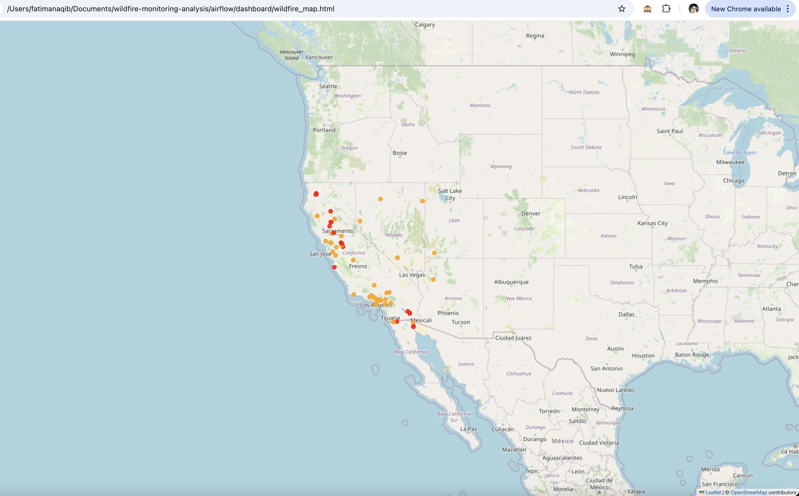

# Wildfire Monitoring Pipeline

Real-time wildfire detection pipeline using NASA FIRMS satellite data. Processes fire detection events through Kafka, stores them in PostgreSQL, and generates interactive map visualizations.

## What This Does

Downloads near real-time wildfire data from NASA's FIRMS API (VIIRS satellites), validates it, streams it through Kafka for real-time processing, stores it in PostgreSQL, and generates interactive Folium maps showing fire locations with intensity markers.

The pipeline runs as an Airflow DAG that orchestrates microservices for ingestion, processing, and visualization. Each component is containerized and exposed as a FastAPI service with health checks and Prometheus metrics.

## Architecture

The pipeline is **event-driven**: Airflow sends commands to Kafka and does not wait for processing. Services react to events asynchronously.

```
                    Kafka (event bus)
    ┌───────────────────────────────────────────────────┐
    │  wildfire.commands.ingest   wildfire.raw.events    │
    │  wildfire.processed.events wildfire.commands...   │
    └───────────────────────────────────────────────────┘
         ↑              ↑              ↑              ↑
         │              │              │              │
    Airflow DAG    Ingestion      Validation    Consumer /
    (sends         (command →     (raw →        Map
     commands)     raw events)    processed)   (→ DB / map)
```

**Flow:**
1. **Airflow** sends an ingestion command to `wildfire.commands.ingest` (and optionally a map command). It does **not** call services over HTTP or wait for completion.
2. **Ingestion service** consumes commands, downloads from NASA FIRMS API, and produces **raw** events to `wildfire.raw.events`.
3. **Validation processor** consumes raw events, validates them, and produces to `wildfire.processed.events`.
4. **Consumer service** consumes processed events and writes to PostgreSQL.
5. **Map service** runs a map consumer that listens to processed events (and map commands) and regenerates the Folium HTML map.

**Components:**
- **Airflow**: Sends commands to Kafka on a schedule; not in the hot path
- **Kafka**: Central event bus (KRaft mode); topics for commands and events
- **kafka-topics-init**: One-off service that creates all required topics after Kafka is healthy
- **Ingestion, Consumer, Map**: FastAPI services with Kafka consumers for event-driven processing
- **Validation processor**: Dedicated service that validates raw events and produces processed events
- **PostgreSQL**: Stores wildfire events with deduplication

## Setup

**Requirements:**
- Docker 20.10+ and Docker Compose 2.0+
- The following ports must be available: 8080, **8081**, 5432, 9092, 8000–8003

**Installation:**

```bash
git clone <repo-url>
cd wildfire-monitoring-analysis
docker compose up -d --build
```

**Automated setup (no manual steps):**

When you run `docker compose up -d`, the following are handled automatically:

- **Kafka topics** – The `kafka-topics-init` service runs once after Kafka is healthy and creates all event-driven topics (`wildfire.commands.ingest`, `wildfire.raw.events`, `wildfire.processed.events`, `wildfire.commands.map.regenerate`, and legacy `wildfire_data`). Ingestion, consumer, map, and Airflow start only after topics exist.
- **Validation processor** – The `validation-processor` service runs continuously and consumes raw events from Kafka, validates them, and produces processed events. No need to start it manually.
- **Event-driven defaults** – The consumer is configured to read from `wildfire.processed.events`; ingestion and map services use the correct Kafka topic env vars for the event-driven pipeline.

You do **not** need to run any manual Kafka topic creation or validation-processor commands for normal operation.

**Initial setup (one-time):**

Run the Airflow DB init and create the admin user once (e.g. if the UI login fails):

```bash
docker compose run --rm airflow-init
docker compose restart airflow-webserver
```

**Access:**
- Airflow UI: http://localhost:8080 (`admin`/`admin`)
- Kafka UI: http://localhost:8081
- Service APIs: http://localhost:8000-8003
- API Docs: http://localhost:8000-8003/docs (each service)
- Generated Maps: `airflow/dashboard/wildfire_map.html`

**Scaling note (API vs workers):**
- `consumer` is already designed as a scalable worker (no host port). The HTTP endpoint for `/health` and `/stats` is `consumer-api`, published on the host port configured by `CONSUMER_API_PORT` in `.env` (defaults to **8002**, so typically `http://localhost:8002`).
- `ingestion-api` and `map-api` are **API-only** containers (they do not run background Kafka consumers).
- `ingestion-worker` and `map-worker` are the **scalable** worker replicas that run Kafka consumers.

Example scaling:

```bash
docker compose up -d --build \
  --scale consumer=3 \
  --scale ingestion-worker=2 \
  --scale map-worker=2
```

## Kafka: Dev vs Production Notes

This repo ships a **3-broker Kafka cluster** in Docker Compose so you can validate **replication** and **consumer scaling** locally.

- **Brokers / availability**: A 3-broker cluster can tolerate **1 broker failure** (assuming topics have replication factor 3 and `min.insync.replicas` is configured appropriately).
- **Replication factor**: This repo configures topic creation using `KAFKA_TOPIC_REPLICATION_FACTOR` (set to `3` in `.env` / `docker-compose.yml`).
- **Partitions / scaling**: A consumer group can scale to **at most the number of partitions** for a given topic. This repo uses:
  - `KAFKA_EVENT_TOPIC_PARTITIONS` (defaults to 6 in compose) for `wildfire.raw.events` and `wildfire.processed.events`
  - `KAFKA_COMMAND_TOPIC_PARTITIONS` (defaults to 3) for command topics

**Production guidance (high-signal):**
- **Prefer dedicated controllers**: For critical production Kafka, avoid “combined” controller+broker nodes; run **3 controllers** and **N brokers** separately.
- **Security**: Add TLS and SASL, and keep brokers off the public internet (private subnets / Kubernetes network policies).
- **Durability**: Use `acks=all` (already used for command publishing) and ensure `min.insync.replicas >= 2` for RF=3 topics.
- **Capacity planning**: Partition counts should be driven by expected throughput and consumer parallelism; changing partitions later is possible but operationally non-trivial.

## Map Example

The pipeline generates interactive Folium maps showing wildfire locations with color-coded markers based on fire intensity. Red markers indicate high-intensity fires (>330K brightness), orange markers show medium-intensity fires.

This is an example of the map generated from recent wildfire detection data:



The map is interactive—you can zoom, pan, switch between OpenStreetMap and satellite tile layers, and click markers for fire details (date, brightness, coordinates). Maps are regenerated when new processed events arrive (map consumer) and when the DAG sends a map command, so the visualization stays up to date with the database.

## Running the Pipeline

**Automatic:** DAG `wildfire_etl_pipeline` runs daily at midnight UTC.

**Manual:** Trigger via Airflow UI or:

```bash
docker compose exec airflow-webserver airflow dags trigger wildfire_etl_pipeline
```

**DAG Tasks (event-driven):**
1. `send_ingestion_command` – Sends a command to Kafka topic `wildfire.commands.ingest`; ingestion service processes it asynchronously
2. `send_map_regeneration_command` – Sends a command to `wildfire.commands.map.regenerate` (optional; maps also auto-update from processed events)
3. Airflow does **not** call ingestion or map over HTTP; processing is driven by Kafka events

## Project Structure

```
wildfire-monitoring-analysis/
├── airflow/
│   ├── dags/wildfire_etl_dag.py    # DAG: sends commands to Kafka
│   ├── scripts/
│   │   └── ensure_kafka_topics.py  # Topic creation (used by kafka-topics-init)
│   ├── etl/                        # Shared ETL modules
│   │   ├── config.py               # Environment/config management
│   │   ├── validation.py           # Record validation logic
│   │   ├── kafka_topics.py         # Topic definitions and creation
│   │   ├── command_producer.py     # Send ingestion/map commands to Kafka
│   │   ├── kafka_producer.py       # Kafka producer (legacy)
│   │   └── generate_map.py         # Folium map generation
│   ├── data/                       # Optional downloaded data
│   └── dashboard/                  # Generated HTML maps
│
├── services/
│   ├── ingestion/app/              # NASA download + command consumer
│   │   ├── main.py                 # FastAPI + /ingest (HTTP)
│   │   └── command_consumer.py    # Kafka: commands → raw events
│   ├── producer/                   # Legacy HTTP producer (optional)
│   ├── consumer/app/               # Processed events → PostgreSQL
│   │   ├── main.py                 # FastAPI + Kafka consumer
│   │   └── validation_processor.py # Raw → processed (also run as container)
│   └── map/app/                    # Map API + event-driven map consumer
│       ├── main.py                 # FastAPI + /generate, /map
│       └── map_consumer.py         # Kafka: events/commands → regenerate map
│
├── kafka_consumer/                 # Standalone consumer (optional)
├── postgres/init/init.sql          # Database schema
├── docs/TESTING_EVENT_DRIVEN_WORKFLOW.md  # Testing guide
└── docker-compose.yml              # Includes kafka-topics-init, validation-processor
└── docker-compose.ha.yml           # Optional: HA Postgres overlay (pgpool + primary/replica)
```

**Design Notes:**
- Event-driven: Airflow publishes commands to Kafka; ingestion, validation, consumer, and map react to events
- `kafka-topics-init` creates topics once; `validation-processor` runs as a separate service
- Ingestion and map services run Kafka consumers in the background alongside FastAPI
- All services expose `/health` and `/metrics`

## API Usage

**Test Services Directly:**

```bash
# Download data
curl -H "X-API-Key: $WILDFIRE_API_KEY" -X POST "http://localhost:8000/ingest?area=-125.0,32.0,-113.0,42.0&day_range=3"

# Produce to Kafka
curl -H "X-API-Key: $WILDFIRE_API_KEY" -X POST "http://localhost:8001/produce"

# Generate map
curl -H "X-API-Key: $WILDFIRE_API_KEY" -X POST "http://localhost:8003/generate?center_lat=37.0&center_lon=-120.0&zoom=5"

# Check consumer status
curl -H "X-API-Key: $WILDFIRE_API_KEY" http://localhost:8002/stats
```

**Health Checks:**

All services respond to `/health`. Consumer service includes running status and uptime.

**Metrics:**

Prometheus metrics at `/metrics` on each service. Tracks request counts, processing times, and Kafka/DB connection status.

## Configuration

**Secrets / sensitive configuration** (do **not** commit real values to git):

Create a local `.env` file (see `.env.example`). `docker-compose.yml` wires these into containers via `${VAR}` interpolation.

- `WILDFIRE_API_KEY`: shared secret for protected FastAPI routes (`X-API-Key` / `Authorization: Bearer ...`)
- `FIRMS_MAP_KEY`: NASA FIRMS map key (required; no default is shipped in code anymore)
- `POSTGRES_USER`, `POSTGRES_PASSWORD`: database credentials (required for services + backups)
- `AIRFLOW_DB`: Airflow metadata database name (defaults to `airflowdb` in compose if unset)
- `AIRFLOW_ADMIN_USERNAME`, `AIRFLOW_ADMIN_EMAIL`, `AIRFLOW_ADMIN_PASSWORD`: bootstrap admin for `airflow-init` (required; no default password)

**Other environment variables** (commonly set in `.env` / compose):

- `FIRMS_AREA`, `FIRMS_DAY_RANGE`: NASA API region and lookback
- `KAFKA_TOPIC`: Consumer reads from `wildfire.processed.events` in event-driven mode
- `KAFKA_INGESTION_COMMAND_TOPIC`, `KAFKA_RAW_EVENTS_TOPIC`, `KAFKA_PROCESSED_EVENTS_TOPIC`, `KAFKA_MAP_COMMAND_TOPIC`: Event-driven topic names
- `POSTGRES_HOST`, `POSTGRES_PORT`, `POSTGRES_DB`, `POSTGRES_HOST_PORT`: connectivity / host port mapping

If you use the HA Postgres overlay (`docker-compose.ha.yml`), also set the HA-specific variables documented in `.env.example`.

**DAG Parameters** (editable in Airflow UI):

- `map_center_lat`, `map_center_lon`: Map center coordinates
- `map_zoom`: Initial zoom level
- `firms_area`: Override default geographic region

**Changing Map Center:**

Edit `airflow/dags/wildfire_etl_dag.py` params or pass via Airflow UI when triggering.

## Data Model

**PostgreSQL Schema** (`wildfire_events` table):

- `latitude`, `longitude`: Fire location (DOUBLE PRECISION)
- `bright_ti4`, `bright_ti5`: Brightness temperatures (Kelvin)
- `acq_date`, `acq_time`: Acquisition timestamp
- `satellite`: Satellite identifier (N, N20, N21)
- `confidence`: Detection confidence (n/h/l)
- `frp`: Fire radiative power (MW)

**Deduplication:**

Unique constraint on `(latitude, longitude, acq_date, acq_time, satellite)`. Duplicate inserts are silently skipped using `ON CONFLICT DO NOTHING`.

**Validation Rules:**

Records must have all required fields, numeric fields must parse to float, enum fields must match valid values. The **validation processor** consumes raw events and produces only valid records to `wildfire.processed.events`; invalid records are logged and skipped.

## Development

**Rebuilding Services:**

After changing ETL or service code, rebuild and restart:

```bash
docker compose build ingestion-api ingestion-worker producer consumer map-api map-worker validation-processor
docker compose up -d
```

**Viewing Logs:**

```bash
docker compose logs -f <service-name>
docker compose logs -f airflow-webserver
docker compose logs -f validation-processor
```

**Database Access:**

```bash
docker compose exec postgres psql -U airflow -d wildfire_db
```

**Kafka Topics:**

```bash
# List topics (event-driven + legacy)
docker compose exec kafka kafka-topics.sh --list --bootstrap-server localhost:9092

# Consume commands or events
docker compose exec kafka kafka-console-consumer.sh \
  --bootstrap-server localhost:9092 \
  --topic wildfire.commands.ingest --from-beginning
docker compose exec kafka kafka-console-consumer.sh \
  --bootstrap-server localhost:9092 \
  --topic wildfire.processed.events --from-beginning
```

**Local Development:**

Services can run locally, but you'll need:
- PostgreSQL running (update `POSTGRES_HOST` in config)
- Kafka running (update `KAFKA_BOOTSTRAP_SERVERS`)
- Shared volumes mounted or adjust file paths in config

## Troubleshooting

**Airflow login fails:**
```bash
docker compose run --rm airflow-init
docker compose restart airflow-webserver
```

**Services won't start:**
Check dependencies and init order (e.g. `kafka-topics-init` must complete before ingestion/consumer/map/airflow):
```bash
docker compose ps
docker compose logs postgres
docker compose logs kafka
docker compose logs kafka-topics-init
```

**No data in database:**
- Trigger the DAG (sends ingestion command); processing is asynchronous
- Check ingestion service logs (command consumer) and validation-processor logs
- Verify events in Kafka: `wildfire.raw.events`, `wildfire.processed.events`
- Consumer reads from `wildfire.processed.events`; check consumer `/stats` and logs

**Map not created / not updating:**
- The map file is created **on `map-api` startup** (initial empty or current-DB map) and when `map-worker` receives Kafka events or a map command.
- If the map file is missing: restart the map API (`docker compose restart map-api`) so it runs startup map generation again, or call the API once: `curl -X POST "http://localhost:8003/generate"`.
- After the first ingestion run, the map consumer will regenerate the map when processed events arrive. Check map service logs for "Map consumer" and "Generating map".

**Markers show but basemap is blank (gray background):**
- This usually means the HTML is trying to load tiles from a **root-relative** URL like `/osm-tiles/...` while you opened the file via `file://...`, which resolves to `file:///osm-tiles/...` (invalid).
- Fix: ensure `MAP_PUBLIC_BASE_URL` is set (see `.env`) so generated HTML uses `http://localhost:8003/osm-tiles/...`, **keep the map container running**, then regenerate the map (`POST /generate` on port **8003**).

**Kafka connection issues:**
- Kafka uses KRaft mode (no Zookeeper)
- Ensure topics exist: `kafka-topics-init` runs automatically on `docker compose up -d`
- Check consumer group lag: consumer service `/stats` endpoint

## Stack

- **Python 3.11**
- **Apache Airflow 2.8.1** - Workflow orchestration
- **FastAPI 0.115.0** - REST APIs
- **Apache Kafka** (KRaft, 3 brokers in Compose) - Message streaming
- **PostgreSQL 14** - Data storage
- **Folium 0.16.0** - Map visualization
- **Confluent Kafka** - Python Kafka client
- **Prometheus client** - Metrics exposure

## Notes

- **NASA API delay**: FIRMS data has 15-30 minute latency
- **Default region**: California bounding box; adjust via DAG params
- **Data retention**: No automatic cleanup; all records persist
- **KRaft mode**: Kafka runs without Zookeeper for simplicity
- **Validation**: Validation processor consumes raw events and produces only valid records to `wildfire.processed.events`
- **Error handling**: Services retry with exponential backoff; failed records are logged but don't stop pipeline

## High Availability (HA) Options

This repo’s default `docker-compose.yml` runs everything on one Docker host (great for dev), but true HA requires redundancy for stateful components.

**What is already HA in this repo:**
- **Kafka**: 3-broker KRaft cluster in compose (tolerates 1 broker loss for RF=3 topics with `min.insync.replicas=2`)
- **Workers**: `consumer`, `ingestion-worker`, `map-worker` can run multiple replicas (consumer groups + map advisory lock)
- **Airflow scheduler**: two scheduler containers are started (only one actively schedules at a time)

**Postgres HA overlay (removes Postgres SPOF):**

```bash
docker compose -f docker-compose.yml -f docker-compose.ha.yml up -d --build
```

This starts a Postgres primary + replica (repmgr) behind `pgpool` and points all services at `pgpool:5432`.

## Contributing

Open issues for bugs or feature requests. PRs welcome. Make sure:
- Code follows existing patterns
- Tests pass (when added)
- Docker builds succeed
- Services start without errors
